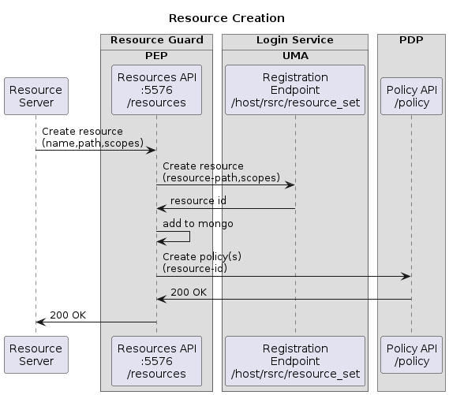
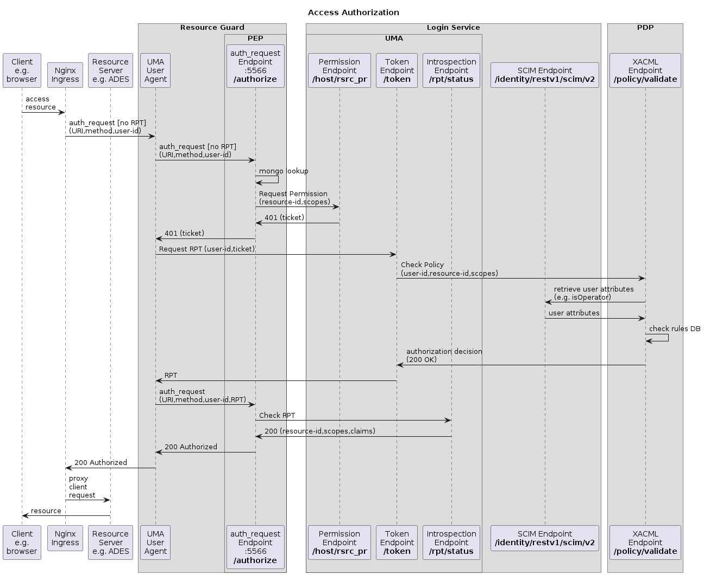

# Overview

The User Management components are illustrated by the following deployment diagram, which shows **_Provided_** interfaces (above) and **_Required_** interfaces (below).

The [**Login Service**](login-service.md) provides an [OpenID Connection (OIDC)](login-service.md#openid-connection-oidc) interface for end-user authentication, a [User Managed Access (UMA)](login-service.md#user-managed-access-uma) interface for resource protection, and a [System for Cross-domain Identity Management (SCIM)](login-service.md#system-for-cross-domain-identity-management-scim) interface for lookup and management of user data. The Login Service interfaces with the PDP via XACML in support of the UMA authorization flow.

The [**Policy Decision Point (PDP)**](pdp.md) provides a [Policy API](pdp.md#additional-information) for creation and management of authorization policies against resources, and a [XACML](pdp.md#extensible-access-control-markup-language-xacml) endpoint for validation (decision) of access requests against the defined policies. The PDP interfaces with the SCIM service to obtain user attributes in support of the authorization decision.

The [**Resource Guard**](resource-guard.md) aggregates the _UMA User Agent_ and the _PEP_:

* The [**UMA User Agent**](uma-user-agent.md) integrates with the Nginx request path to intercept and authorize access requests to resource servers (e.g. ADES) - by implementing the [Nginx `auth_request`](pep.md#nginx-auth_request) interface. The UMA User Agent handles the UMA flow to obtain the access token from the _Token Endpoint_ - the policy enforcement is handed off to the PEP via its `auth_request` interface;
* The [**Policy Enforcement Point (PEP)**](pep.md#pep-policy-enforcement-point) provides a [Resources API](pep.md#resources-api) through which Resource Servers are able to register and manage their resources. The PEP interfaces with the Login Service for UMA flows for resource registration and policy enforcement, and with the PDP Policy API for resource policy registration.

The [**User Profile**](user-profile.md) provides a web UI for users to manage their configuration within the platform. The User Profile interfaces with the OIDC service for user authentication and with the SCIM service to retrieve and manage user attributes.

## Interactions

The building block responsibilities and interactions are illustrated by sequence diagrams for key flows.

### Resource Creation

Resource creation is typically triggered by the Resource Servers that host the protected resources.

The Resource Server calls the Resources API of the PEP, providing the details of the resource to be registered.

The PEP registers the resource via the UMA endpoint of the Login Service, which returns the UUID of the new resource.

The PEP records the unique resource ID and its associated path in its local database, before registering the authorization policies for the resource/owner via the Policy API of the PDP.

### Access Authorization

Access to Resource Servers and their resources is protected by the Resource Guard, which integrates with Nginx to provide the authorization enforcement. Thus, the clients request is received by Nginx which proxies to the Resource Server based upon the advice of the Resource Guard.

The authorization request arrives at the UMA User Agent - initially without an access token [Relying Party Token (RPT)] - and is forwarded to the PEP for the authorization enforcement.

The PEP uses the URI of the original request to lookup the resource in its local database to obtain the applicable unique resource ID. The PEP calls the Permission Endpoint of the Login Service to obtain an appropriate ticket matching the requested resource and scopes (based upon the request method).

The ticket is returned to the UMA User Agent, which accesses the Token Endpoint of the Login Service to exchange the ticket for an access token (RPT).

The Login Service calls the XACML Endpoint of the PDP to obtain a policy decision based upon the requesting user, the resource ID and the requested scopes. Following a successful decision, the Login Service returns the RPT (access token) to the UMA User Agent.

The UMA User Agent repeats the enforcement request to the PEP, this time with the RPT. The PEP uses the Introspection Endpoint of the Login Service to check the validity of the RPT.

The 'success' decision is returned via the UMA User Agent to Nginx, which continues to proxy the request and so delivers the protected resource to the Client.
