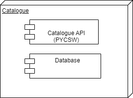

# Resource Catalogue [TODO]

==[To be completed by EOX/EOfarm]==

> The purpose of this section is to identify the building-block, its role in the architecture, and its relationship to the other building-blocks expressed through the interfaces it provides and consumes. The idea is to provide a singular entrypoint to the EOEPCA building-blocks. 
> In the first instant, gather relevant information from existing docs/wikis where it exists, and collate here. 
> Use dedicated markdown files to separate the sub-section content if needed. 
> Use diagrams where useful.

## Description

> The Use Cases for the Resource Catalogue are described below.

> * Publish Metadata. Metadata can be an input or output for the ADES ( Application Deployment & Execution Service).
> * Publish Product. Metadata relating to a product and containing a reference to that product.
> * Publish Processing Service. Metadata describing a Processing Service.
> * Publish Interactive Application. Metadata describing the needs of an Application.
> * Publish Collection.  Metadata describing a collection of Metadata.
> * Compliance. Metadata compliance required before it is published. 
> * Search Metadata.  Find desired Metadata.
> * Search Temporally. Time based search. 
> * Search by AOI. Area of Interest based search. 
> * Search Input for Data Processing. Input required by a process in the ADES.
> * Search Parameters for Processing. Parameters required to help configure a process in the ADES.
> * Authorisation. This may be requites to perform Publish and Search based Use Cases.

## Overview

> The high level design is described below.

## Interfaces

The following interfaces are provided by the Resource Catalogue.

* Publishing and Search
    * OGC CSW 3.0.0 and 2.0.2 interfaces
    * Certified OGC Compliant and OGC Reference Implementation for both CSW 2.0.2 and CSW 3.0.0
* Search
    * OGC OpenSearch with EO, Geo and Time Extensions
    * OGC API Records
    * STAC (SpatioTemporal Asset Catalog)
    * Federated catalogue distributed searching
* Metadata
    * Implements ISO Metadata Application Profile 1.0.0
    * Support for ISO-19115-1 and ISO-19115-2  (Geographic information)
* Ingestion
    * Harvesting support for WMS, WFS, WCS, WPS, WAF, CSW, SOS

### Ingestion Interfaces

The Resource Catalogue provides the following interfaces for ingestion of metadata records:

* **pycsw Python API** 
  Python library with classes for interfacing with pycsw instance - for example to `insert()` records.
* **pycsw CLI** 
  Command-line tool `pycsw-admin.py` will import (`load-records`) records from XML files in the filesystem.
* **OGC CSW Transactions** 
  pycsw supports OGC CSW Transactions for `Insert`, `Update` and `Delete`...
    * Insert: full XML documents can be inserted as per CSW-T
    * Update: updates can be made as full record updates or record properties against a csw:Constraint
    * Delete: deletes can be made against a csw:Constraint

> TODO: provide some examples for loading records

## Dependencies

> The Resource Catalogue is designed to support the ADES component. It can also be used directly if needed.

## Additional Information

> Please refer to the latest <a href="https://github.com/EOEPCA/eoepca/tree/develop/release-notes">EOEPCA release notes</a> for more information. 
> 
> The Use Cases above were derived from the EOEPCA <a href="https://eoepca.github.io">Use Case Analysis Document</a>.

