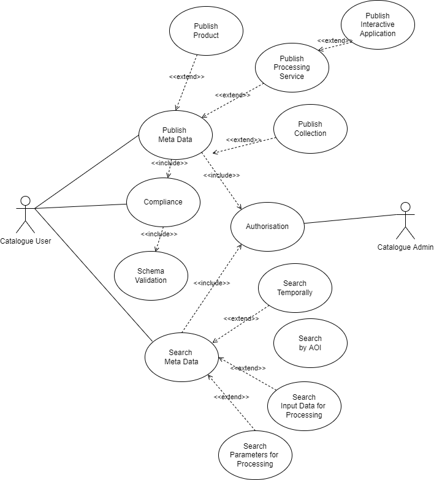

# Resource Catalogue [TODO]

> The purpose of this section is to identify the building-block, its role in the architecture, and its relationship to the other building-blocks expressed through the interfaces it provides and consumes. The idea is to provide a singular entrypoint to the EOEPCA building-blocks.  
> This section describes the Resource Catalogue building-block. The relationship of the Resource Catalogue to other components is described in the <a href="../../system/overview/">System Overview</a>.

## Description1

> Description to include:
> 
> * role in the architecture
> * functional capabilities

## Description2

> The main Use Cases for the Resource Catalogue are described below. 

> Use cases are
> * Publish Metadata.  This Metadata can be an input or output for the ADES ( Application Deployment & Execution Service).
> * Publish Product. Metadata relating to a product and containing a reference to that product.
> * Publish Processing Service. Metadata describing a Processing Service.
> * Publish Interactive Application. Metadata describing the needs of an Application.
> * Publish Collection.  Metadata describing a collection of Metadata.
> * Compliance. Metadata compliance required before it is published. 
> * Search Metadata.  Find desired Metadata.
> * Search Temporally. Time based search. 
> * Search by AOI. Area of Interest based search. 
> * Search Input for Data Processing. Input required by a process in the ADES.
> * Search Parameters for Processing. Parameters required to help configure a process in the ADES.
> * Authorisation. This may be requites to perform Publish and Search based Use Cases.

## Description

> Description to include:
> 
> * Publish Metadata.  This Metadata can be an input or output for the ADES ( Application Deployment & Execution Service).
> * Publish Product. Metadata relating to a product and containing a reference to that product.
> * Publish Processing Service. Metadata describing a Processing Service.
> * Publish Interactive Application. Metadata describing the needs of an Application.
> * Publish Collection.  Metadata describing a collection of Metadata.
> * Compliance. Metadata compliance required before it is published. 
> * Search Metadata.  Find desired Metadata.
> * Search Temporally. Time based search. 
> * Search by AOI. Area of Interest based search. 
> * Search Input for Data Processing. Input required by a process in the ADES.
> * Search Parameters for Processing. Parameters required to help configure a process in the ADES.
> * Authorisation. This may be requites to perform Publish and Search based Use Cases.

## Interfaces

> Resource Catalogue implements the following interfaces. 
> 
> Search Interfaces 
> * OGC API Records
> * STAC (SpatioTemporal Asset Catalog)
> * OpenSearch
>   * OGC OpenSearch Geo and Time Extensions
>   * OGC OpenSearch EO Extensions
> Search and Publish Interfaces 
> * OGC CSW 3.0.0 and 2.0.2 interfaces
>   * Certified OGC Compliant and OGC Reference Implementation for both CSW 2.0.2 and CSW 3.0.0
>   * Harvesting support for WMS, WFS, WCS, WPS, WAF, CSW, SOS
>   * Federated catalogue distributed searching
> Metadata Interfaces 
> * Implements ISO Metadata Application Profile 1.0.0
> * Support for ISO-19115-1 and ISO-19115-2  (Geographic information)

## Dependencies

> Describe links with other eoepca components - e.g. interfaces consumed.

## Additional Information

> Include descriptions of anything that is relevant to help users of the component. 
> Links to other relevant information.
