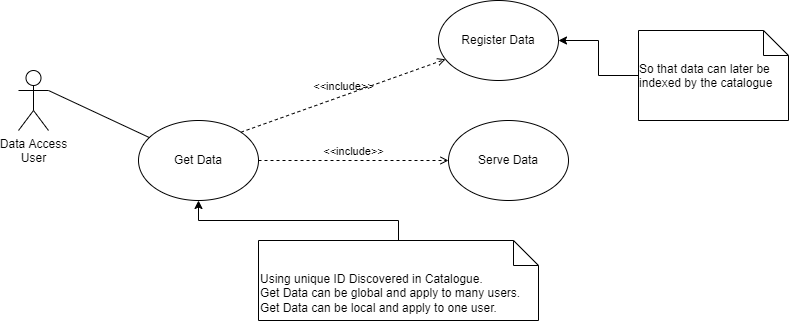
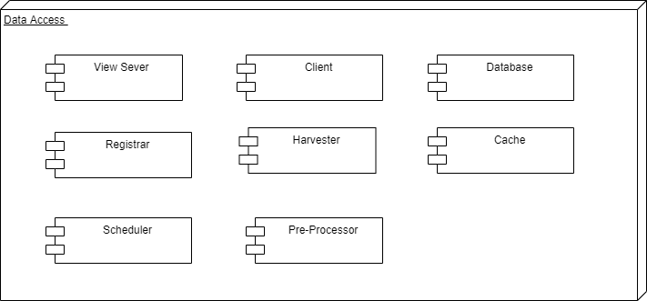

# Data Access [TODO]

==[To be completed by EOX/EOfarm]==

> The purpose of this section is to identify the building-block, its role in the architecture, and its relationship to the other building-blocks expressed through the interfaces it provides and consumes. The idea is to provide a singular entrypoint to the EOEPCA building-blocks.  
> This section describes the Resource Catalogue building-block. The relationship of the Resource Catalogue to other components is described in the <a href="../../system/overview/">System Overview</a>.

## Description

> The Use Cases for Data Access are described below.

> * Get Data 

## Overview

> The high level design is described below.

## Interfaces

The following interfaces are provided by Data Access.

* Get Data
    * OGC WMS 1.1 - 1.3 interfaces
    * OGC WMTS 1.0 interfaces with automatic caching
    * OGC WCS 2.0 interfaces with EO Application Profile

### Harvesting

The Data Access harvester supports following back-ends from which to harvest:

* OpenSearch
* File-based 
  > TODO - what is meant by file-based - STAC Catalog?

The harvester supports post-processors to adapt/enrich the harvested metadata before it is registered...

* **CREODIASOpenSearchSentinel2Postprocessor** 
  Sentinel-2 metadata from the CREODIAS catalogue.

Other post-processors can be plugged-in through configuration of the harvester component.

### Registration

Data can be directly registered with the Data Access component by pushing a STAC item to the `register_queue` of the data-access `redis` service. During registration, the Data Access component also [ingests the metadata record to the Resource Catalogue](catalogue.md#ingestion-interfaces), uisng the pycsw python API.

## Dependencies

> The Data Access component is dependent upon the Catalogue and the S3 bucket.

## Additional Information

> Please refer to the latest <a href="https://github.com/EOEPCA/eoepca/tree/develop/release-notes">EOEPCA release notes</a> for more information. 
> 
> The Use Cases above were derived from the EOEPCA <a href="https://eoepca.github.io">Use Case Analysis Document</a>.
