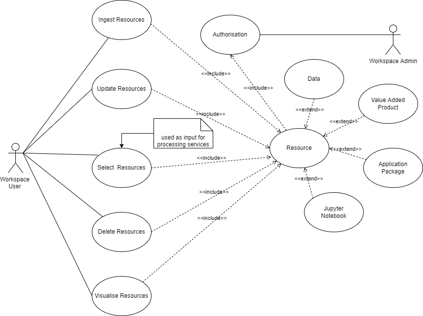
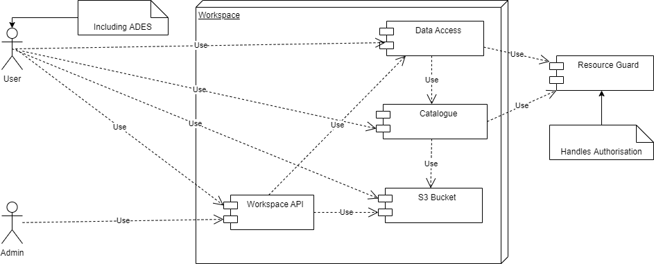

# Workspace [TODO]

==[To be completed by EOX/EOfarm]==

==Should cover the Workspace API and the Minio Bucket API==

> The purpose of this section is to identify the building-block, its role in the architecture, and its relationship to the other building-blocks expressed through the interfaces it provides and consumes. The idea is to provide a singular entrypoint to the EOEPCA building-blocks. 
> In the first instant, gather relevant information from existing docs/wikis where it exists, and collate here. 
> Use dedicated markdown files to separate the sub-section content if needed. 
> Use diagrams where useful.

## Description

> The Use Cases for the Workspace are described below.

> * Ingest Resources.
> * Update Resources.
> * Select Resources.
> * Delete Resources.
> * Visualise Resources.

## Overview

> The high level design is described below.

## Interfaces

> The following interfaces are used by the Resource Catalogue.
> 
> * RESTful service to implement the above Use Cases.
>     * GET /workspaces/  (Select Resources)
>     * POST /workspaces/  (Ingest Resources)
>     * PATCH /workspaces/  (Update Resources)
>     * DELETE /workspaces/  (Delete Resources)
>
> * Visualise ???????
>     * OGC WMS 1.1 - 1.3 interfaces
>     * OGC WMTS 1.0 interfaces with automatic caching
>     * OGC WCS 2.0 interfaces with EO Application Profile

## Dependencies

> The Workspace is dependent upon the Data Access component and the Catalogue Component.

## Additional Information

> Please refer to the latest <a href="https://github.com/EOEPCA/eoepca/tree/develop/release-notes">EOEPCA release notes</a> for more information. 
> 
> The Use Cases above were derived from the EOEPCA <a href="https://eoepca.github.io">Use Case Analysis Document</a>.

